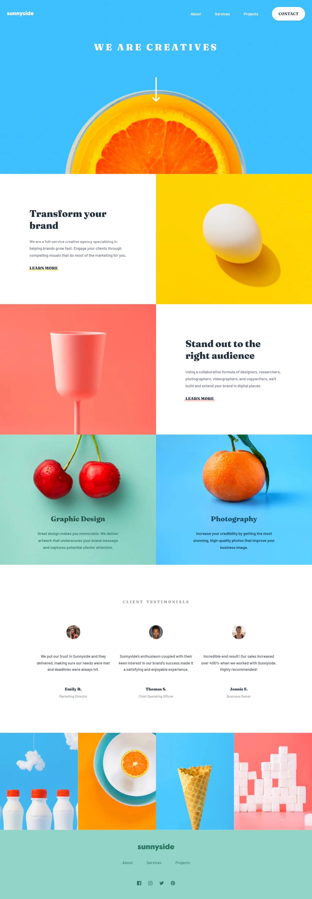

# Frontend Mentor - Sunnyside agency landing page solution

This is a solution to the [Sunnyside agency landing page challenge on Frontend Mentor](https://www.frontendmentor.io/challenges/sunnyside-agency-landing-page-7yVs3B6ef). Frontend Mentor challenges help you improve your coding skills by building realistic projects.

## Table of contents

- [Overview](#overview)
  - [The challenge](#the-challenge)
  - [Screenshot](#screenshot)
  - [Links](#links)
- [My process](#my-process)
  - [Built with](#built-with)
  - [What I learned](#what-i-learned)
  - [Continued development](#continued-development)
  - [Useful resources](#useful-resources)
- [Author](#author)
- [Acknowledgments](#acknowledgments)

**Note: Delete this note and update the table of contents based on what sections you keep.**

## Overview

### The challenge

Users should be able to:

- View the optimal layout for the site depending on their device's screen size
- See hover states for all interactive elements on the page

### Screenshot



## My process

### Built with

- Flexbox
- CSS Grid
- [React](https://reactjs.org/) - JS library
- [Vite.js](https://vitejs.dev/) - React framework

### What I learned

With this project I learned the semantics of html, modular css abd typescript

```html
<h1>Some HTML code I'm proud of</h1>
```

```css
.proud-of-this-css {
  color: papayawhip;
}
```

```ts
interface ICard {
  title: string;
  image: string;
  description: string;
}
```

## Author

- Website - [Carlos Andres Spagnolo](https://spagnolo-carlos.netlify.app/)
- Frontend Mentor - [@yourusername](https://www.frontendmentor.io/profile/SpagnoloCarlos)
- LinkedIn - [Carlos Andres Spagnolo](https://www.linkedin.com/in/carlos-spagnolo-andres/)
- Instagram - [@carlos.spagnolo.dev](https://www.instagram.com/carlos.spagnolo.dev/)
- Email - [carlos.andres.spagnolo@gmail.com](mailto:your.email@gmail.com)

## Acknowledgments

### Cloning Repository

1. Open your terminal.
2. Navigate to the location where you want to clone the repository.
3. Run the following command:

```bash
  git clone https://github.com/SpagnoloCarlos/sunnyside
  cd sunnyside
  npm install
  npm run dev
```
